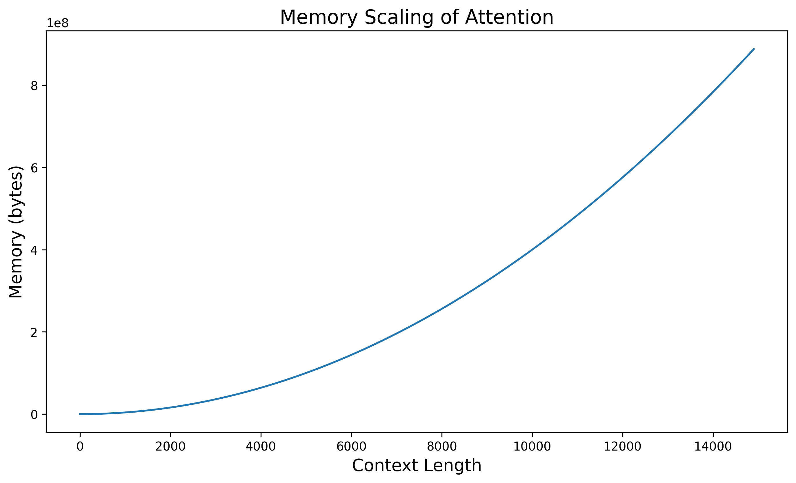

# Attention

From-scratch implementations of core transformer concepts in Jax Numpy.

For example - an [implementation](https://github.com/gardberg/attention/blob/main/src/t5.py#L19) of [Google's T5 model](https://arxiv.org/abs/1910.10683), all the way from a linear layer to autoregressive encoder-decoder text generation.

See `examples/t5_generation.ipynb`

```python
# Load pytorch model
torch_t5_model = T5ForConditionalGeneration.from_pretrained("google-t5/t5-small")
tokenizer = AutoTokenizer.from_pretrained("google-t5/t5-small")

# Copy weights to jax state
state = to_jax_state(torch_t5_model)

jax_t5_model = T5Model(vocab_size=32128, emb_size=512)
rng = jax.random.PRNGKey(42)

INPUT = "translate English to French: Hello!"

input_ids = jnp.array(tokenizer(INPUT, return_tensors="pt").input_ids)
pred_token_ids = jax_t5_model.generate(state, input_ids, rng, max_length=40)
pred_text = tokenizer.decode(pred_token_ids[0], skip_special_tokens=True)

print(pred_text)
# >> Bonjour!
```


### Demonstrating attention quadratic time and memory scaling

<div style="display: flex; justify-content: space-between;">
    
    
</div>

### Dense example

See `examples/example_dense.ipynb`.

<div style="text-align:center;">
    
</div>

### Setup

*Python version:* 3.11.6

Run tests with `pytest`

Filter for a specific test to run with `pytest -k test_name`

Enable debug logs with `pytest --log-cli-level=DEBUG`

Run formatting with `black .`

### TODO

- [x] Implement softmax
- [x] Implement network
- [x] Implement batch norm
- [x] Implement vanilla attention
- [x] Implement multi headed attention

- [x] Add tests to compare with pytorch implementations
- [x] Simplify logging
- [ ] Switch to `__name__` logging
- [x] Switch to using single Array type for shape hinting

#### Transformer

- [x] Switch to using `poetry` for dependencies
- [x] Attention Masking
- [x] Layer Norm
- [x] Dropout
- [x] Positional Encoding
- [x] Tokenizer (tiktoken)
- [x] Encoder
- [x] Decoder
- [x] Transformer
- [x] Seq2Seq
- [x] T5
  - [x] Inference using random weights
  - [x] Inference using t5-small weights
  - [ ] Beam search
  - [ ] CLI inference example
- [ ] Wav2Vec
- [ ] GPT2
  - [x] Dense
  - [x] Attention
    - [x] Fix interfering test (fixed by limiting the scope of each test to function)
  - [x] GPT2Block
  - [x] GPT2Model
  - [ ] GPT2 Generation

- [x] Use torch hooks to debug tests
- [x] Implement hooks for basemodel

#### Improvements

- [x] RMSNorm
- [x] SwiGLU layer
- [x] GeGLU
- [x] Rotational Positional Encoding
- [x] K/V Cache
- [ ] Multi-Query Attention (https://arxiv.org/abs/1911.02150)
- [ ] Grouped Query Attention

- [ ] Vectorize stuff with vmap
- [ ] Windowed attention with recomputation
- [ ] Streaming LLM attention

#### Extra fun stuff!

- [x] Snake activation

#### dev

`source .venv/bin/activate`
`uv add <package>`
`uv run pytest`

### Links

Tree Map: https://jax.readthedocs.io/en/latest/jax-101/05.1-pytrees.html

Stateful computation: https://jax.readthedocs.io/en/latest/jax-101/07-state.html

Efficient Streaming Attention: https://arxiv.org/abs/2309.17453

Softmax off by one: https://www.evanmiller.org/attention-is-off-by-one.html

ML Library in Jax: https://flax.readthedocs.io/en/latest/

NN Example: https://jax.readthedocs.io/en/latest/notebooks/Neural_Network_and_Data_Loading.html

#### Transformers

Illustrated transformer: https://jalammar.github.io/illustrated-transformer/

Annotated transformer: https://nlp.seas.harvard.edu/2018/04/03/attention.html

Pytorch implementation https://github.com/pytorch/pytorch/blob/main/torch/nn/functional.py#L5101

Annotated pytorch implementation https://nn.labml.ai/transformers/mha.html
https://nn.labml.ai/transformers/models.html

Attention explained https://storrs.io/attention/

https://math.stackexchange.com/questions/63074/is-there-a-3-dimensional-matrix-by-matrix-product

Self-attention Does Not Need O(n^2) Memory https://arxiv.org/abs/2112.05682

#### Modern Transformer

Reformer: The Efficient Transformer https://arxiv.org/abs/2001.04451

RoFormer: Enhanced Transformer with Rotary Position Embedding https://arxiv.org/abs/2104.09864

Fast Transformer Decoding: One Write-Head is All You Need https://arxiv.org/abs/1911.02150 (Multi-Query Attention)

Llama2: https://arxiv.org/abs/2307.09288

GLU Variants Improve Transformer: https://arxiv.org/abs/2002.05202
