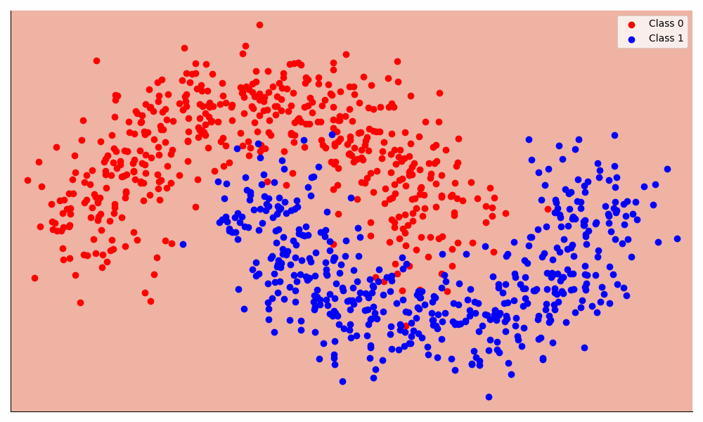

# Attention

Exploring attention and related concepts in Jax.

See `example.ipynb` for a simple network training example.

### Setup

*Python version:* 3.11.6

Run tests with `pytest`

Show logs with `pytest --log-level-cli=25` to show custom logs logged with `logger.log(25, "message")`
It is also set to `25` by default in `pyproject.toml`.

Filter for a specific test to run with `pytest -k test_name`

### TODO

- [x] Implement softmax
- [x] Implement network
- [ ] Implement batch norm
- [ ] Implement vanilla attention
- [ ] Implement multi headed attention
- [ ] Windowed attention
- [ ] Windowed attention with recomputation
- [ ] Streaming LLM attention

- [x] Add tests to compare with pytorch implementations

#### Links

Tree Map: https://jax.readthedocs.io/en/latest/jax-101/05.1-pytrees.html

Stateful computation: https://jax.readthedocs.io/en/latest/jax-101/07-state.html

Efficient Streaming Attention: https://arxiv.org/abs/2309.17453

Softmax off by one: https://www.evanmiller.org/attention-is-off-by-one.html

ML Library in Jax: https://flax.readthedocs.io/en/latest/

NN Example: https://jax.readthedocs.io/en/latest/notebooks/Neural_Network_and_Data_Loading.html