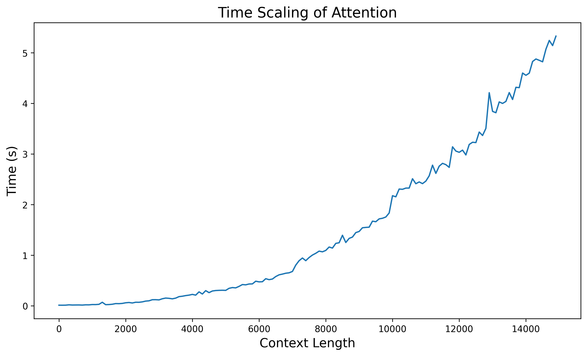
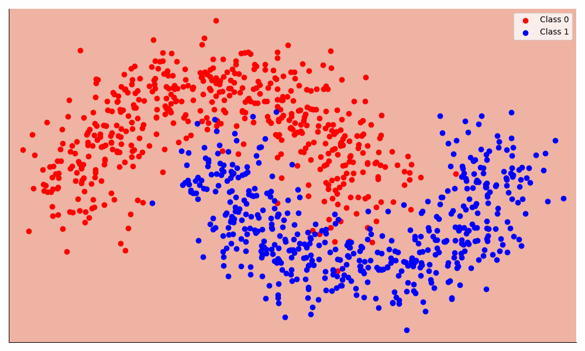

# Attention

Exploring attention and related concepts in Jax.

### Demonstrating quadratic time and memory scaling

### Dense example

See `examples/example_dense.ipynb`.

### Setup

*Python version:* 3.11.6

Run tests with `pytest`

Show logs with `pytest --log-level-cli=25` to show custom logs logged with `logger.log(25, "message")`
It is also set to `25` by default in `pyproject.toml`.

Filter for a specific test to run with `pytest -k test_name`

### TODO

- [ ] Ensure split is used on all rng keys in functions
If the same key is split in two different places, does it result in the same subkeys?

- [x] Implement softmax
- [x] Implement network
- [x] Implement batch norm
- [x] Implement vanilla attention
- [x] Implement multi headed attention

- [x] Add tests to compare with pytorch implementations

#### GPT

- [x] Switch to using `poetry` for dependencies
- [x] Attention Masking
- [x] Layer Norm
- [x] Dropout
- [x] Positional Encoding
- [ ] Tokenizer
- [ ] Encoder
- [ ] Decoder
- [ ] Transformer

#### Improvements

- [ ] Vectorize stuff with vmap
- [ ] Rotational Positional Encoding
- [ ] Windowed attention with recomputation
- [ ] Streaming LLM attention
- [ ] Grouped Query Attention

#### Using Poetry

Make sure local venv is activated, which contains poetry:

`source .venv/Scripts/activate` - Windows

`poetry add <package>`

`poetry check` - check for errors in `pyproject.toml`

`poetry run pytest` - use local venv to run pytest

`poetry install` - install dependencies specified in `pyproject.toml`

Have added pytest config options to `pyproject.toml` so that they are set by default. E.g. `log_cli = true` and `log_cli_level = 25` to show custom logs.

- [ ] Is it worth creating a dev environment in poetry?

### Links

Tree Map: https://jax.readthedocs.io/en/latest/jax-101/05.1-pytrees.html

Stateful computation: https://jax.readthedocs.io/en/latest/jax-101/07-state.html

Efficient Streaming Attention: https://arxiv.org/abs/2309.17453

Softmax off by one: https://www.evanmiller.org/attention-is-off-by-one.html

ML Library in Jax: https://flax.readthedocs.io/en/latest/

NN Example: https://jax.readthedocs.io/en/latest/notebooks/Neural_Network_and_Data_Loading.html

#### Transformers

Illustrated transformer: https://jalammar.github.io/illustrated-transformer/

Annotated transformer: https://nlp.seas.harvard.edu/2018/04/03/attention.html

Pytorch implementation https://github.com/pytorch/pytorch/blob/main/torch/nn/functional.py#L5101

Annotated pytorch implementation https://nn.labml.ai/transformers/mha.html

Attention explained https://storrs.io/attention/

https://math.stackexchange.com/questions/63074/is-there-a-3-dimensional-matrix-by-matrix-product

#### Modern Transformer

Reformer: The Efficient Transformer https://arxiv.org/abs/2001.04451

RoFormer: Enhanced Transformer with Rotary Position Embedding https://arxiv.org/abs/2104.09864

Fast Transformer Decoding: One Write-Head is All You Need https://arxiv.org/abs/1911.02150 (Multi-Query Attention)